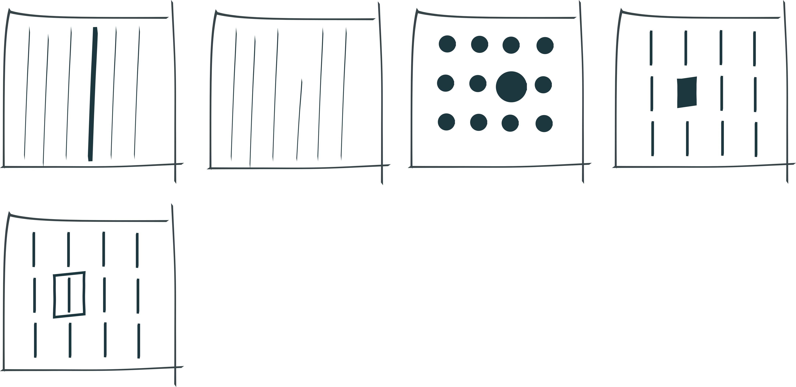
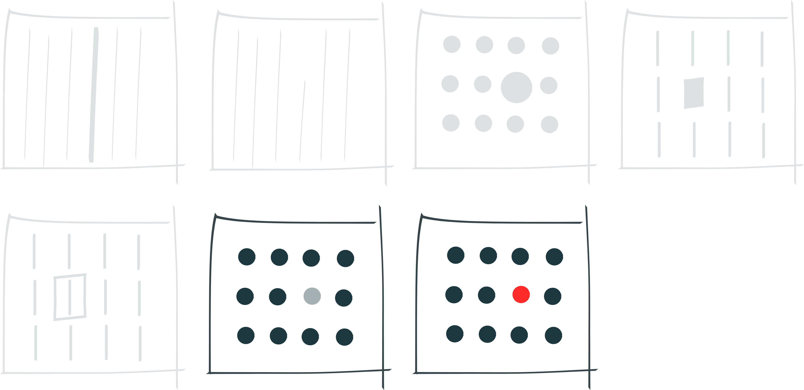

```{r setup, include=FALSE}
knitr::opts_chunk$set(echo = FALSE,
                      warning = FALSE,
                      message = FALSE,
                      comment = NA)
library(dplyr) # tidy data
library(tidyr) # tidy data
library(ggplot2) # plotting
library(lubridate) # dates
library(patchwork) # arrange plots
library(DT) # data tables
library(HistData) # nightingale data
library(sf) # gis data
library(spData) # us polygons
library(treeio) # visualize phylogenetic trees
library(ggtree) # ggplot shortcut
library(scales) # for gdp
library(viridis) # colour maps

my_theme <- theme_minimal() +
  theme(
    panel.grid = element_blank()
  )

theme_set(my_theme)
```

## {.large .noH1}

```{r, nightingale_1}
# see https://www.r-bloggers.com/2021/03/florence-nightingales-rose-charts-and-others-in-ggplot2/

nightingale <- HistData::Nightingale # load data
# add period column
nightingale$period <- ifelse(nightingale$Date <= "1855-03-01", "April 1854 to March 1855", "April 1855 to March 1856")
# make long
nightingale_long <- pivot_longer(data = nightingale,
                            cols = ends_with("rate"),
                            names_to = "cause",
                            values_to = "rates"
                            )
# clean data
nightingale_long$cause <- gsub(".rate", "", nightingale_long$cause)
nightingale_long$cause <- factor(nightingale_long$cause, levels = c("Disease", "Other", "Wounds"))
nightingale_long$Month <- factor(nightingale_long$Month, levels = c("Apr", "May", "Jun", "Jul", "Aug", "Sep", "Oct", "Nov", "Dec", "Jan", "Feb", "Mar"))
nightingale_long$sqrt <- round(sqrt(nightingale_long$rates), 2)

# build plots - just 1854-1855
base_plot_1854 <- ggplot(data = subset(nightingale_long, Date <= "1855-03-01"),
                               aes(x = Month, y = rates, fill = cause))

base_plot_1854_sqrt <- ggplot(data = subset(nightingale_long, Date <= "1855-03-01"),
                               aes(x = Month, y = sqrt, fill = cause))

(nightingale_cox_1854_sqrt <- base_plot_1854_sqrt +
  geom_col(width = 1) +
  coord_polar(start = 11) +
  theme(
    legend.position = "none",
    axis.title = element_blank(),
    axis.text.y = element_blank(),
    panel.grid.major = element_line(colour = "#f5f5f5")
  ) +
  scale_fill_brewer(palette = "Set1"))
```

## {.large .noH1}

```{r, nightingale_2}
# build plots
nightingale_base <- ggplot(data = nightingale_long,
                          aes(x = Month, y = rates, fill = cause)) +
  geom_col()

nightingale_base_sqrt <- ggplot(data = nightingale_long,
                          aes(x = Month, y = sqrt, fill = cause)) +
  geom_col()

(nightingale_cox_sqrt <- nightingale_base_sqrt +
  geom_col(width = 1) +
  coord_polar(start = 11) +
  labs(x = "", y = "", fill = "Cause of Mortality") +
  scale_fill_brewer(palette = "Set1") +
  facet_wrap(~period) +
  theme(
    panel.grid.major = element_line(colour = "#f5f5f5"),
    legend.position = "bottom",
    axis.text.y = element_blank()
  ) +
  guides(fill = guide_legend(title.position = "top")))
```

## {.large .noH1}

```{r, nightingale_3}
nightingale_col_sqrt <- nightingale_base_sqrt +
  facet_wrap(~period) +
  labs(y = "Mortality", fill = "Cause of Mortality") +
  scale_fill_brewer(palette = "Set1") +
  theme(axis.text.y = element_blank(),
        axis.text.x = element_text(angle = 45))

nightingale_cox_sqrt_nl <- nightingale_cox_sqrt +
  theme(legend.position = "none")

nightingale_cox_sqrt_nl / nightingale_col_sqrt +
  plot_layout(guides = 'collect')
```

## {.large .noH1}

```{r, nightingale_4}
nightingale_cox_1854 <- ggplot(data = subset(nightingale_long, Date <= "1855-03-01"),
                               aes(x = Month, y = rates, fill = cause)) +
  geom_col(width = 1) +
  coord_polar(start = 11) +
  theme(
    legend.position = "none",
    axis.title = element_blank(),
    axis.text.y = element_blank(),
    panel.grid.major = element_line(colour = "#f5f5f5")
  ) +
  scale_fill_brewer(palette = "Set1")

nightingale_col_1854 <- base_plot_1854 +
  geom_col() +
  labs(y = "Mortality (annaul rate per 1000)", fill = "Cause of Mortality\nApr 1854 - Mar 1855") +
  scale_fill_brewer(palette = "Set1") +
  theme(axis.text.x = element_text(angle = 45))
  

nightingale_col_1854_sqrt <- base_plot_1854_sqrt +
  geom_col() +
  labs(y = "Mortality (√annaul rate per 1000)") +
  scale_fill_brewer(palette = "Set1") +
  theme(legend.position = "none",
        axis.text.x = element_text(angle = 45))

(nightingale_cox_1854_sqrt + nightingale_cox_1854) / (nightingale_col_1854_sqrt + nightingale_col_1854) +
  plot_layout(guides = 'collect')
```

# What is Data Visualization?

## {.largeText}

Data visualization turns data into **visual information**. We could turn data into auditory or tactile information as well.

## {.largeText}

[Data visualization turns data into **visual information**. We could turn data into auditory or tactile information as well.]{.grey}

This involves **abstraction**, as shapes, colours etc are used to represent the data.

## {.largeText}

[Data visualization turns data into **visual information**. We could turn data into auditory or tactile information as well.]{.grey}

[This involves **abstraction** as shapes, colours etc are used to represent the data.]{.grey}

Visual and data **literacies** are needed to interpret both the data and the abstraction.

# Why Do We Visualize Data?

------------------------------------------------------------------------

> Data visualization is the graphical display of abstract information for two purposes: sense-making (also called data analysis) and communication.

[Stephen Few. [Data Visualization for Human Perception](https://www.interaction-design.org/literature/book/the-encyclopedia-of-human-computer-interaction-2nd-ed).]{.citation}

# What Makes an Effective Visualization?

------------------------------------------------------------------------

> The key to the success of any visual, beautiful or not, is providing access to information so that the user may gain knowledge. A visual that does not achieve this goal has failed.

[Noah Iliinsky (2010). [On Beauty. In *Beautiful visualization: looking at data through the eyes of experts*](https://go.exlibris.link/KJLP9Jc9).]{.citation}

------------------------------------------------------------------------

> A beautiful visualization has a clear goal, a message, or a particular perspective on the information that it is designed to convey. Access to this information should be as straightforward as possible, without sacrificing any necessary, relevant complexity.

[Noah Iliinsky (2010). [On Beauty. In *Beautiful visualization: looking at data through the eyes of experts*](https://go.exlibris.link/KJLP9Jc9).]{.citation}

# Attributes & Perception

------------------------------------------------------------------------

> Even though an object as a whole might take some conscious effort to identify, the basic visual attributes that combine to make up that object are perceived without any conscious effort.

[Stephen Few (2004). [Tapping the Power of Visual Perception](http://www.perceptualedge.com/articles/ie/visual_perception.pdf).]{.citation}

------------------------------------------------------------------------

[]{.noheader}

------------------------------------------------------------------------

[]{.noheader}

## {.extraLargeText}

**F**or[m]{.tinyText}

**[C]{.red}[o]{.blue}[l]{.green}[o]{.purple}[u]{.orange}[r]{.yellow}**

**Positio[n]{.rotate}**

## Form {.medium}



## Colour {.medium}



## Position {.medium}


## Preattentive Attributes {.medium}


------------------------------------------------------------------------

```{r, rivers_1, results = 'asis'}
cat(sort(rivers))
```

------------------------------------------------------------------------

```{r, rivers_2, results = 'asis'}
rivers_df <- as.data.frame(table(rivers))
colnames(rivers_df) <- c("River Length", "Frequency")
rivers_dt <- datatable(rivers_df, rownames = F)
cat(sort(rivers))
rivers_dt
```

------------------------------------------------------------------------

```{r, rivers_3, results='asis'}
cat(sort(rivers))
```

```{r, rivers_4}
rivers_dt
stem(rivers, scale = 2)
```

------------------------------------------------------------------------

```{r, rivers_5, results='asis'}
cat(sort(rivers))
```

```{r, rivers_6}
stem(rivers, scale = 2)
```

## {.dot .noH1}

```{r, rivers_7, results='asis'}
cat(sort(rivers))
```

```{r, rivers_8}
stem(rivers, scale = 2)
```

```{r, rivers_9, dpi = 72, out.width = "45%", fig.asp = .9}
rivers_jitter_base <- ggplot(rivers_df) +
  my_theme +
  theme(
    text = element_text(size = 15)
  ) +
  scale_y_reverse() +
  labs(x = "", y = "")

rivers_jitter_base +
  geom_point(aes(y = as.numeric(as.character(`River Length`)), x = Frequency), size = 3, colour = "#00428C")
```

## {.dot .noH1}

```{r, rivers_10, results='asis'}
cat(sort(rivers))
```

```{r, rivers_11}
stem(rivers, scale = 2)
```

```{r, rivers_12, out.width = "45%", fig.asp = .9}
set.seed(1)

rivers_jitter_base +
  geom_jitter(aes(y = as.numeric(as.character(`River Length`)), x = Frequency, colour = factor(Frequency)), width = 0.25, size = 3, colour = "#00428C")
```

## {.dot .noH1}

```{r, rivers_13, results='asis'}
cat(sort(rivers))
```

```{r, rivers_14}
stem(rivers, scale = 2)
```

```{r, rivers_15, out.width = "45%", fig.asp = .9}
set.seed(1)

rivers_jitter_base +
  geom_jitter(aes(y = as.numeric(as.character(`River Length`)), x = Frequency, colour = factor(Frequency)), width = 0.5, size = 3, colour = "#00428C")
```

## {.dot .noH1}

```{r, rivers_16, results='asis'}
cat(sort(rivers))
```

```{r, rivers_17}
stem(rivers, scale = 2)
```

```{r, rivers_18, out.width = "45%", fig.asp = .9}
set.seed(1)

rivers_jitter_base +
  geom_jitter(aes(y = as.numeric(as.character(`River Length`)), x = Frequency, colour = factor(Frequency)), width = 0.5, size = 3) +
  scale_color_brewer(palette = "Set1") +
  theme(legend.position = "none")
```

## {.dot .noH1}

```{r, rivers_19, results='asis'}
cat(sort(rivers))
```

```{r, rivers_20}
stem(rivers, scale = 2)
```

```{r, rivers_21, out.width = "45%", fig.asp = .9}
rivers_sorted <- sort(rivers, decreasing = F)

rivers_sorted_base <- 
  ggplot() +
  geom_histogram(aes(rivers_sorted), bins = 36, fill = '#00428C', colour = '#00428C') +
  theme_minimal() +
  theme(
    panel.grid.major = element_blank(),
    panel.grid.minor = element_blank(),
    text = element_text(size = 15)
    ) +
  xlab("") +
  ylab("")

rivers_sorted_base +
  coord_flip() +
  scale_x_reverse()

```

## {.dot .noH1}

```{r, rivers_22, results='asis'}
cat(sort(rivers))
```

```{r, rivers_23}
stem(rivers, scale = 2)
```

```{r, rivers_24, out.width = "45%", fig.asp = .9}
rivers_sorted_base +
  scale_y_continuous(minor_breaks = seq(1, 40, 1))
```

## {.dot .noH1}

```{r, rivers_25, results='asis'}
cat(sort(rivers))
```

```{r, rivers_26, fig.width = 18, fig.asp = .4}
rivers_sorted_bar <- rivers_sorted_base +
  scale_y_continuous(minor_breaks = seq(1, 40, 1))

rivers_sorted_bins <-  ggplot() +
  geom_histogram(aes(rivers_sorted), bins = 5, fill = '#00428C', colour = '#00428C') +
  theme_minimal() +
  theme(
    panel.grid.major = element_blank(),
    panel.grid.minor = element_blank(),
    text = element_text(size = 15)
    ) +
  xlab("") +
  ylab("")

layout <- "
AA#BB
"

rivers_sorted_bar + rivers_sorted_bins + plot_layout(design = layout)
```

## {.dot .noH1}

```{r, rivers_27, results='asis'}
cat(sort(rivers))
```

```{r, rivers_28, fig.width = 18, fig.asp = .4}
rivers_sorted_bar <- rivers_sorted_base +
  scale_y_continuous(minor_breaks = seq(1, 40, 1))

rivers_sorted_scale <- rivers_sorted_bar +
  scale_y_continuous(limits=c(10,35), oob = rescale_none)

layout <- "
AA#BB
"

rivers_sorted_bar + rivers_sorted_scale + plot_layout(design = layout)
```

## {.large .noH1}

```{r}
# load us state centre coords and name
states_centre <- data.frame(state.name, state.center)
# remove Hawaii and Alaska
states_centre <- subset(states_centre, state.name != "Hawaii" & state.name != "Alaska")
# sf data type
states_centre <- st_as_sf(states_centre, coords = c(2,3), crs = 4326)

# load us electoral votes count - see https://www.archives.gov/electoral-college/2020
electoral_votes <- read.csv("data/elections_2020.csv")
electoral_votes$candidate <- factor(electoral_votes$candidate, levels = c("Trump", "Biden"))

# load polygon data
us_poly <- us_states[, c(2, 7)]

# data set by electoral votes
us_electoral_votes <- merge(states_centre, electoral_votes, by = "state.name")

# data set by state
us_states_votes <- merge(us_poly, electoral_votes, by.x = "NAME", by.y = "state.name")

(state_plot <- ggplot() +
    geom_sf(data = us_states_votes, aes(fill = candidate)) +
    scale_fill_brewer(palette = "Set1") +
    theme(legend.position = "none",
          axis.text = element_blank()))
```

## {.large .noH1}

```{r}
(state_size_plot <- ggplot() +
    geom_sf(data = us_states_votes, aes(fill = candidate), alpha = 0.15) +
    geom_sf(data = us_electoral_votes, aes(colour = candidate, size = electoral.votes), alpha = 0.75) +
    scale_size_continuous(range = c(2, 40)) +
    scale_colour_brewer(palette = "Set1") +
    scale_fill_brewer(palette = "Set1") +
    theme(legend.position = "none",
          axis.text = element_blank()))
```

## {.large .noH1}

```{r}
state_plot / state_size_plot
```

## {.ny_times .noH1}


------------------------------------------------------------------------

<!-- see https://www.hertfordshiremercury.co.uk/news/hertfordshire-news/london-underground-tube-map-geography-4417455 -->
[]{.tm}

------------------------------------------------------------------------

[]{.tm}

------------------------------------------------------------------------

<!-- see https://transitmap.net/circle-tube-roberts/ -->
[]{.tm}

## {.large .noH1}

```{r}
# see https://xiayh17.gitee.io/treedata-book/chapter4.html

nwk <- system.file("extdata", "sample.nwk", package="treeio")
tree <- read.tree(nwk)
set.seed(2017-02-16)
tree <- rtree(50)
a <- ggtree(tree) +
  geom_nodepoint(color="grey", size=3, alpha=.8) +
  geom_tippoint(size=3, alpha=.5)
b <- ggtree(tree, layout="slanted")  +
  geom_nodepoint(color="grey", size=3, alpha=.8) +
  geom_tippoint(size=3, alpha=.5)
c <- ggtree(tree, layout="circular")  +
  geom_nodepoint(color="grey", size=3, alpha=.8) +
  geom_tippoint(size=3, alpha=.5)
d <- ggtree(tree, layout="fan", open.angle=120)  +
  geom_nodepoint(color="grey", size=3, alpha=.8) +
  geom_tippoint(size=3, alpha=.5)
e <- ggtree(tree, layout="equal_angle")  +
  geom_nodepoint(color="grey", size=3, alpha=.8) +
  geom_tippoint(size=3, alpha=.5)
f <- ggtree(tree, layout="daylight")  +
  geom_nodepoint(color="grey", size=3, alpha=.8) +
  geom_tippoint(size=3, alpha=.5)
g <- ggtree(tree, branch.length='none')  +
  geom_nodepoint(color="grey", size=3, alpha=.8) +
  geom_tippoint(size=3, alpha=.5)
h <- ggtree(tree, branch.length='none', layout='circular')  +
  geom_nodepoint(color="grey", size=3, alpha=.8) +
  geom_tippoint(size=3, alpha=.5)
i <- ggtree(tree, layout="daylight", branch.length = 'none')  +
  geom_nodepoint(color="grey", size=3, alpha=.8) +
  geom_tippoint(size=3, alpha=.5)

a + b + c + d + e + f + g + h + i +
  plot_layout(ncol = 3)
```

## {.large .noH1}

```{r}
# get the data
climate_files <- list.files(path = "data", pattern = "^en_climate.*.csv$")
climate_file_list <- lapply(climate_files, function(x)read.csv(paste0("data/", x)))
climate_data <- do.call(rbind, climate_file_list)

# clean the data
climate_data$Date.Time <- as_date(climate_data$Date.Time)
names(climate_data)[names(climate_data) == "Max.Temp...C."] <- "max_temp"

# graph the data
climate_graph <- ggplot(climate_data,
                        aes(x = yday(Date.Time), y = max_temp, colour = factor(Year))
                        ) +
  geom_line() +
  labs(x = "Day",
       y = "Max Temp (°C)",
       colour = "Year") +
  scale_color_brewer(palette = "Paired", direction = -1)

# spurious scale
climate_graph_scale <- climate_graph +
  ylim(c(-45, 75))
```

```{r}
(climate_graph + climate_graph_scale) / climate_graph +
  plot_layout(guides = 'collect')
```

## {.large .noH1}

```{r}
climate_graph_truncated <- ggplot(subset(climate_data, Month == "8"),
                                  aes(x = yday(Date.Time), y = max_temp, colour = factor(Year))
                        ) +
  geom_line() +
  labs(x = "Day (August)",
       y = "Max Temp (°C)",
       colour = "Year") +
  scale_color_brewer(palette = "Paired", direction = -1)

climate_graph / climate_graph_truncated
```


## {.large .noH1}

```{r}
# read the data
climate_monthly <- read.csv("data/climate-monthly.csv")
# subset
august <- subset(climate_monthly, LOCAL_MONTH == 8, select = c(LOCAL_YEAR, MEAN_TEMPERATURE))
august$MEAN_TEMPERATURE <- round(august$MEAN_TEMPERATURE, 4)

august_plot <- ggplot(data = august, aes(x = LOCAL_YEAR, y = MEAN_TEMPERATURE, colour = MEAN_TEMPERATURE)) +
  geom_line() +
  geom_point() +
  labs(x = "Year",
       y = "Mean Temp (°C) - August") +
  my_theme +
  theme(legend.position = "none")

(august_plot_viridis <- august_plot +
  scale_colour_viridis_c(option = "viridis"))
```

## {.large .noH1}

```{r}
(august_plot_viridis_lm <- august_plot_viridis +
  stat_smooth(method = "lm", level = 0, colour = "skyblue"))
```

## {.large .noH1}

```{r}
august_plot_magma_lm <- august_plot +
  scale_colour_viridis_c(option = "magma") +
  stat_smooth(method = "lm", level = 0, colour = "red")

layout <- "1111
            #2##"

august_plot_viridis_lm + august_plot_magma_lm +
  plot_layout(design = layout)
```

## {.centre .largeText}

Colour should be meaningful and take into account the nature of the data being graphed.

## {.centre}

Sequential


Diverging


Qualitative


## {.centre .largeText}

[Colour should be meaningful and take into account the nature of the data being graphed.]{.grey}

Colour should be attune to things like contrast and color vision deficiencies (CVD).

## {.centre .small .noH1}

<!-- see https://en.wikipedia.org/wiki/Shinobu_Ishihara -->


## {.centre .largeText}

[Colour should be meaningful and take into account the nature of the data being graphed.]{.grey}

[It should also be attune to things like contrast and color vision deficiencies (CVD).]{.grey}

Colour should be carefully mapped to continuous data.

## {.medium .noH1}

```{r}
# see https://cran.r-project.org/web/packages/viridis/vignettes/intro-to-viridis.html

viridis_bar <- data.frame(a = 1:100,
                b = 1)

colour_base <- ggplot(data = viridis_bar, aes(x = b, y = a, fill = a)) +
  geom_col() +
  coord_flip() +
  labs(x = "", y = "") +
  theme(legend.position = "none",
        text = element_blank())

magma_plot <- colour_base +
  scale_fill_viridis(option = "magma", direction = -1)

viridis_plot <- colour_base +
  scale_fill_viridis(option = "viridis", direction = -1)

mako_plot <- colour_base +
  scale_fill_viridis(option = "mako", direction = -1)

cividis_plot <- colour_base +
  scale_fill_viridis(option = "cividis", direction = -1)

turbo_plot <- colour_base +
  scale_fill_viridis(option = "turbo", direction = -1)

magma_plot / viridis_plot / mako_plot / cividis_plot / turbo_plot
```

## {.resources}

| | | |
| --- | --- | --- |
| Colour picker | ColorBrewer | https://colorbrewer2.org/ |
| Contrast | Material Design | https://m3.material.io/ |
| Colour Scales | Fabio Crameri | https://www.fabiocrameri.ch/ |

------------------------------------------------------------------------

## {.poptable .noH1}

```{r pop-data-table_1}
# load the data
levgdp <- read.csv("data/lifeExpectencyVSgpd.csv", header = TRUE, na.strings = c("", " ", "NULL"))
# tidy up
colnames(levgdp) <- c("Country", "Code", "Year", "Population", "Continent", "Life Expectency", "GDP")
# subset
levgdp_2015 <- subset(levgdp, Year == 2015 & GDP != "NA" & `Life Expectency` != "NA" & Code != "NA" & Continent != "NA")
# make reproducible
set.seed(2)

# print a random sample
head(levgdp_2015[sample(nrow(levgdp_2015), 20), ], 20)
```

## {.poptable .noH1 .td7 .td8}

```{r pop-data-table_2}
set.seed(2)
# print a random sample
head(levgdp_2015[sample(nrow(levgdp_2015), 20), ], 20)
```

## {.large .noH1}

```{r pop-plot_bw, dpi = 72}
levgdp_base <- ggplot (levgdp_2015) +
  labs(x = "GDP", y = "Life Expectency", colour = "Continent") +
  scale_color_viridis_d()


levgdp_base +
  geom_point(aes(GDP, `Life Expectency`), size = 5) +
  scale_x_continuous(limits = c(0, 150000), labels = scales::dollar_format(prefix = "$"))
```

## {.poptable .noH1 .td5 .td6 .td7 .td8}

```{r pop-data-table_3}
set.seed(2)
# print a random sample
head(levgdp_2015[sample(nrow(levgdp_2015), 20), ], 20)
```

## {.large .noH1}

```{r pop-plot_colour}
levgdp_base +
  geom_point(aes(GDP, `Life Expectency`, colour = factor(Continent)), size = 5) +
  scale_x_continuous(limits = c(0,150000), labels = dollar_format(prefix = "$")) +
  guides(colour = guide_legend(override.aes = list(size=10)))
```

## {.large .noH1}

```{r pop-plot_size}
levgdp_base +
  geom_point(aes(GDP, `Life Expectency`, colour = factor(Continent), size = Population)) +
  scale_x_continuous(limits = c(0, 150000), labels = dollar_format(prefix = "$")) +
  scale_size(range = c(2,15), guide = "none") +
  guides(colour = guide_legend(override.aes = list(size=10)))
```

## {.large .noH1}

```{r pop-plot_alpha}
(levgdp_2015_alpha <-  levgdp_base +
    geom_point(aes(GDP, `Life Expectency`, colour = factor(Continent), size = Population), alpha = 0.7) +
    scale_x_continuous(limits = c(0, 150000), labels = dollar_format(prefix = "$")) +
    scale_size(range = c(2,15), guide = "none") +
    guides(colour = guide_legend(override.aes = list(size=10))))
```

## {.large .noH1}

```{r pop-plot_log}
(levgdp_2015_log <- levgdp_base +
  geom_point(aes(GDP, `Life Expectency`, colour = factor(Continent), size = Population), alpha = 0.7) +
  scale_x_log10(
    breaks = c(0L, 50000L, 100000L, 150000L),
    labels = dollar_format(prefix = "$")) +
  scale_size(range = c(2,15), guide = "none") +
  scale_y_continuous(
    breaks = c(50,60,70,80),
    limits = c(50,85)) +
  guides(colour = guide_legend(override.aes = list(size=10))))
```

## {.large .noH1}

```{r pop-plot_comparison}
levgdp_2015_alpha / levgdp_2015_log +
  plot_layout(guides = 'collect')
```

## {.large .noH1}

```{r pop-plot_lm}
levgdp_2015_alpha_lm <- levgdp_2015_alpha +
  geom_smooth(aes(GDP, `Life Expectency`), method = "lm", se = F)

levgdp_2015_lm <- levgdp_base +
  geom_point(aes(GDP, `Life Expectency`, colour = factor(Continent), size = Population), alpha = 0.7) +
  scale_x_log10(
    breaks = c(0L, 50000L, 100000L, 150000L),
    labels = dollar_format(prefix = "$")) +
  scale_size(range = c(2,15), guide = "none") +
  scale_y_continuous(
    breaks = c(50,60,70,80),
    limits = c(50,85)) +
  guides(colour = guide_legend(override.aes = list(size=10))) +
  geom_smooth(aes(GDP, `Life Expectency`), method = "lm", se = F)

levgdp_2015_alpha_lm / levgdp_2015_lm +
  plot_layout(guides = 'collect')
```

## {.large .noH1}

```{r pop-plot_facet}
levgdp_2015_lm +
  facet_wrap( ~ Continent) +
  theme(legend.position = "none")
```


## Data and Provenance {.medium}

::: image

:::


