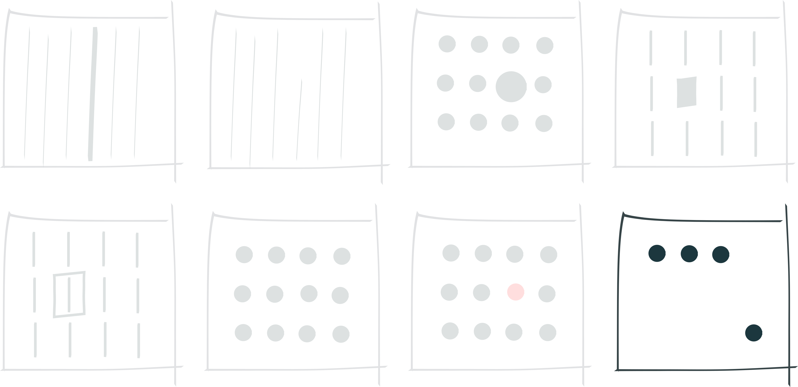
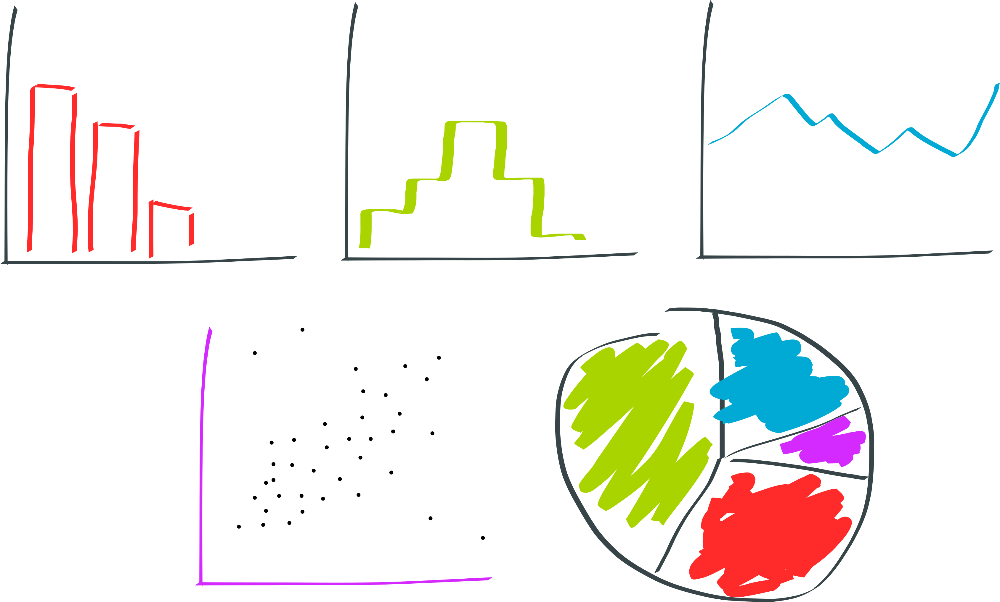
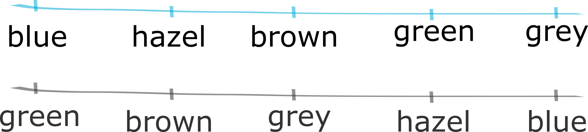
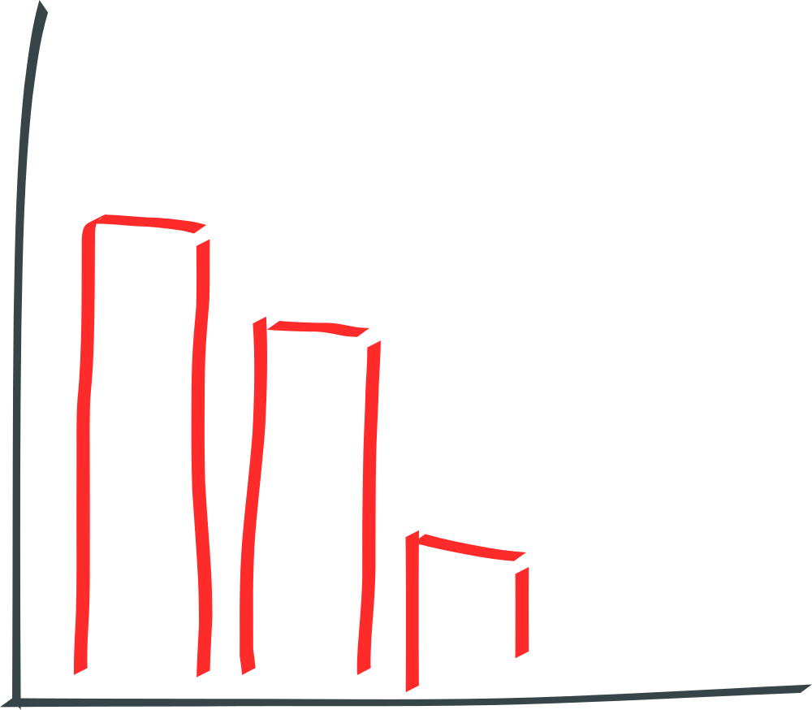
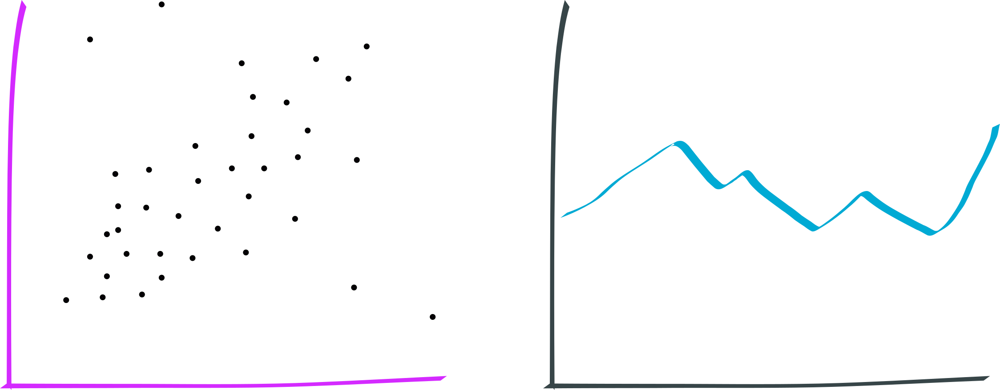

```{r setup, include=FALSE}
knitr::opts_chunk$set(echo = FALSE,
                      message = FALSE,
                      warning = FALSE,
                      fig.height=10,
                      fig.width=19,
                      out.width = "80%")

knitr::read_chunk("scripts/nightingale.R")
knitr::read_chunk("scripts/Temperature.R")

library(ggplot2)
library(ggtext)
library(DT)
```

```{r colours}
one.palette <- "#1f78b4"
two.palette <- c("#1f78b4", "#b2df8a")
three.palette <- c("#a6cee3", "#1f78b4", "#b2df8a")
three.palette.two <- c("#e41a1c", "#377eb8", "#4daf4a")
four.palette <- c("#a6cee3", "#1f78b4", "#b2df8a", "#33a02c")
five.palette <- c("#ffffcc", "#a1dab4", "#41b6c4", "#2c7fb8", "#253494")
six.palette <- c("#1b9e77", "#d95f02", "#7570b3", "#e7298a", "#66a61e", "#e6ab02")
```

------------------------------------------------------------------------

```{r, nightingale-polar-plot}
```

------------------------------------------------------------------------

```{r, nightingale-side-by-side-plot}
```

------------------------------------------------------------------------

```{r rivers-list, results = 'asis'}
cat(sort(rivers))
```

------------------------------------------------------------------------

```{r rivers-list-and-table, results = 'asis'}
cat(sort(rivers))

rivers_df <- as.data.frame(table(rivers))
rivers_df$Freq <- as.numeric(as.character(rivers_df$Freq))
rivers_df$rivers <- as.numeric(as.character(rivers_df$rivers))
colnames(rivers_df) <- c("River Length", "Count")

datatable(rivers_df, rownames = F)
```

------------------------------------------------------------------------

```{r rivers-list-table-and-slplot, results='asis'}
cat(sort(rivers))
datatable(rivers_df, rownames = F)
```

```{r slplot-1}
stem(rivers, scale = 2)
```

------------------------------------------------------------------------

```{r rivers-list-and-slplot, results='asis'}
cat(sort(rivers))
```

```{r slplot-2}
stem(rivers, scale = 2)
```

------------------------------------------------------------------------

```{r rivers-list-slplot-and-dotplot, results='asis'}
cat(sort(rivers))
```

```{r slplot-3}
stem(rivers, scale = 2)
```

```{r rivers-dotplot, dpi = 72, out.width = "42%", fig.asp = .9}
rivers_dot <- ggplot(rivers_df, aes(y = `River Length`, x = Count)) +
  theme_minimal() +
  theme(
    text = element_text(size = 40)
  ) +
  scale_y_reverse() +
  labs(x = "", y = "")

rivers_dot +
  geom_point(size = 7, colour = one.palette)
  
```

------------------------------------------------------------------------

```{r rivers-stem-jitter, results='asis'}
cat(sort(rivers))
```

```{r slplot-4}
stem(rivers, scale = 2)
```

```{r rivers-jitter, out.width = "42%", fig.asp = .9}
rivers_dot +
  geom_jitter(width = 0.2, size = 7, colour = one.palette)
```

------------------------------------------------------------------------

```{r rivers-stem-lots-of-jitter, results='asis'}
cat(sort(rivers))
```

```{r slplot-5}
stem(rivers, scale = 2)
```

```{r rivers-lots-of-jitter, out.width = "42%", fig.asp = .9}
set.seed(1)

rivers_dot +
  geom_jitter(width = 0.5, size = 7, colour = one.palette)
```

------------------------------------------------------------------------

```{r, results='asis'}
cat(sort(rivers))
```

```{r}
stem(rivers, scale = 2)
```

```{r, out.width = "42%", fig.asp = .9}
set.seed(1)

rivers_dot +
  geom_jitter(aes(colour = factor(Count)), width = 0.5, size = 7) +
  scale_color_brewer(palette = "Dark2") +
  theme(
    legend.position = 'none'
  )
```

------------------------------------------------------------------------

```{r rivers-list-stem-barplot-1, results='asis'}
cat(sort(rivers))
```

```{r slplot-6}
stem(rivers, scale = 2)
```

```{r rivers-barplot-1, out.width = "42%", fig.asp = .9}
rivers_sorted <- sort(rivers, decreasing = F)

rivers_sorted_base <- ggplot() +
  geom_histogram(aes(rivers_sorted), bins = 36, fill = one.palette) +
  theme_minimal() +
  theme(
    text = element_text(size = 40)
    ) +
  xlab("") +
  ylab("")

rivers_sorted_base +
  coord_flip() +
  scale_x_reverse() +
  theme(
    panel.grid.major = element_blank(),
    panel.grid.minor = element_blank(),
  )
```

------------------------------------------------------------------------

```{r rivers-list-stem-barplot-2, results='asis'}
cat(sort(rivers))
```

```{r slplot-7}
stem(rivers, scale = 2)
```

```{r rivers-barplot-2, out.width = "42%", fig.asp = .9}
rivers_sorted_base
```

## Overview

-   What we're not talking about
-   What is data visualization
-   Why we visualize data
-   Visual attributes & perception
-   Data types & graphs
-   Visual layering of content
-   Questionable approaches to graphing
-   Scientific data, transparency, and reproducibility

## What We're Not Talking About

-   3D visualizations
-   Info graphics

## What is Data Visualization?

## What is Data Visualization?{.largeText}

Data visualization turns data into visual information. We could turn data into auditory or tactile information as well.

## What is Data Visualization?{.largeText}

[Data visualization turns data into visual information. We could turn data into auditory or tactile information as well.]{.grey}

This involves abstraction as shapes, colours etc are used represent the data.

## What is Data Visualization?{.largeText}

[Data visualization turns data into visual information. We could turn data into auditory or tactile information as well.]{.grey}

[This involves abstraction as shapes, colours etc which are used represent the data.]{.grey}

Visual and data literacies are needed to interpret both the data and the abstraction.

## Why Do We Visualize Data?{.largeText}

## A Defintion

> Data visualization is the graphical display of abstract information for two purposes: sense-making (also called data analysis) and communication.

[Stephen Few. [Data Visualization for Human Perception](https://www.interaction-design.org/literature/book/the-encyclopedia-of-human-computer-interaction-2nd-ed).]{.citation}

## Attributes & Perception

> Even though an object as a whole might take some conscious effort to identify, the basic visual attributes that combine to make up that object are perceived without any conscious effort.

[Stephen Few (2004). [Tapping the Power of Visual Perception](http://www.perceptualedge.com/articles/ie/visual_perception.pdf).]{.citation}

## An Example


## An Example


## Preattentive Attributes

-   Form
-   Colour
-   Position

## Form

::: image

:::

## Colour

::: image

:::

## Position

::: image

:::

## Preattentive Attributes

::: image

:::

## Common Visualizations

::: image

:::

## Basic Data Types

::: image

:::

## Categorical Data {.center}

**Nominal data**

[**No order**]{style="color:#00aad4ff;"}

::: medium

:::

**Ordinal data**

[**Intrinsic order**]{style="color:#aad400ff;"}

::: medium

:::

## Categorical Data {.center}

**Nominal data**

[**No order**]{style="color:#00aad4ff;"}

::: medium

:::

**Ordinal data**

[**Intrinsic order**]{style="color:#aad400ff;"}

::: medium

:::

## Bar Plots {.center}

**Visualization tool**

[**Frequency plots with bar charts**]{style="color:#ff2a2aff;"}

::: small

:::

##  {.noheader}

```{r}
library(palmerpenguins)
set.seed(2)
head(penguins[sample(nrow(penguins), 20), ], 20)
```

##  {.graph .noheader .td1}

```{r}
set.seed(2)
head(penguins[sample(nrow(penguins), 20), ], 20)
```

##  {.graph .center}

```{r}
species <- ggplot() +
  theme_minimal() +
  theme(
    text = element_text(size = 40)
  ) +
  labs(x = "Species", y = "Count")

no.order <- species +
  geom_bar(aes(penguins$species), fill = one.palette)

no.order
```

##  {.graph .center}

```{r}
penguins$speciesordered <- factor(penguins$species, levels = c("Chinstrap", "Gentoo", "Adelie"))

order <- species +
  geom_bar(aes(penguins$speciesordered), fill = one.palette) +
  ylab("")

no.order
order
```

##  {.graph .noheader}

```{r}
set.seed(2)
diamonds[sample(nrow(diamonds), 20), ]
```

##  {.noheader .td3}

```{r}
set.seed(2)
diamonds[sample(nrow(diamonds), 20), ]
```

##  {.graph .center}

```{r}
d.w <- diamonds
d.w$colorOrdered <- factor(d.w$color, levels = c("J", "I", "D", "H", "F", "E", "G"))

diamond.no.order <- ggplot(d.w) +
  geom_bar(aes(colorOrdered), fill = one.palette) +
  theme_minimal() +
  theme(
    text = element_text(size = 40)
  ) +
  labs(x = "Colour", y = "Count")

diamond.no.order
```

##  {.graph .center}

```{r}
diamond.order <- ggplot(diamonds) +
  geom_bar(aes(color), fill = one.palette) +
  theme_minimal() +
  theme(
    text = element_text(size = 40)
  ) +
  labs(x = "Colour", y = "")

diamond.no.order
diamond.order
```

## Things to Consider

##  {.graph .center}

```{r}
penguins$speciesordered <- factor(penguins$species, levels = c("Chinstrap", "Gentoo", "Adelie"))

order.no.space <- species +
  geom_bar(aes(penguins$speciesordered), fill = one.palette, width = 1)

order.no.space
order
```

##  {.graph .center}

```{r}
penguins$speciesordered <- factor(penguins$species, levels = c("Chinstrap", "Gentoo", "Adelie"))

order.ylim <- species +
  geom_bar(aes(penguins$speciesordered), fill = one.palette) +
  coord_cartesian(ylim = c(50,150))

order.ylim
order
```

##  {.graph .center}

```{r}
penguins$speciesordered <- factor(penguins$species, levels = c("Chinstrap", "Gentoo", "Adelie"))

order.col <- species +
  geom_bar(aes(penguins$speciesordered, fill = penguins$speciesordered)) +
  scale_fill_brewer(palette = "Dark2") +
  labs(fill = "Species")

order.col
order
```

##  {.graph .center}

```{r}
order.col
```

Summary count of Penguins by species. *n* = 344

## Bar Charts with more than one Categorical Variable

##  {.noheader .td2 .td3}

```{r}
set.seed(2)

diamonds[sample(nrow(diamonds), 20), ]
```

##  {.graph .center}

```{r}
d.base <- ggplot(diamonds) +
  theme_minimal() +
  theme(
    text = element_text(size = 40)
  ) +
  labs(x = "color", y = "Count", fill = "Cut") +
  scale_fill_manual(values = five.palette)

d.stack <- d.base +
  geom_bar(aes(fill = cut, x = color), stat = "count")

d.side <-d.base +
  geom_bar(aes(fill = cut, x = color), stat = "count", position = "dodge")
  
d.side +
  theme (
    legend.position = "none"
  )
d.stack +
  labs(y = "")
```

## Numeric Data {.center}

**Discrete** = [**Counted**]{style="color:#aad400ff;"}

**Continuous** = [**Measured**]{style="color:#00aad4ff;"}

::: smallmedium

:::

## Numeric Data {.center}

**Interval** = [**Greater or less than**]{style="color:#ff2a2aff;"}

**Ratio** = [**Percentage more or less**]{style="color:#d42affff;"}

::: smallmedium

:::

## Counts of Numeric Data {.center}

**Visualization tool**

[**Frequency plots with histograms**]{style="color:#aad400ff;"}

::: small

:::

##  {.graph .noheader .td5}

```{r}
penguins <- penguins[,-9]

set.seed(2)

head(penguins[sample(nrow(penguins), 20), ], 20)
```

##  {.center .graph}

```{r}
histo.base <- ggplot(penguins) +
  theme_minimal() +
  theme(
    text = element_text(size = 40),
    axis.title.x = element_markdown()
  ) +
  labs(x = "Flipper Length (mm) *n* = 342", y = "Count")

histo20 <- histo.base +
  geom_histogram(aes(flipper_length_mm), bins = 20, fill = one.palette)

histo20
```

##  {.center .graph}

```{r}
histo5 <- histo.base +
  geom_histogram(aes(flipper_length_mm), bins = 5, fill = one.palette) +
  labs(y = "")

histo20
histo5
```

##  {.center .graph}

```{r}
histo.seperate <- ggplot(penguins, aes(x = flipper_length_mm, fill = species)) +
  geom_histogram(position = 'identity', alpha = 0.5, bins = 20) +
  theme_minimal() +
  theme(
    text = element_text(size = 40),
    legend.key.size = unit(3, "cm")
  ) +
  scale_fill_manual(values = three.palette.two) +
  labs(x = "Flipper Length (mm)", y = "", fill = "Species") +
  coord_cartesian(ylim = c(0,40))

histo20
histo.seperate
```

## Comparing Variables {.center}

Dot Plots, Line Graphs & Scatter Plots

::: medium

:::

##  {.graph .noheader}

```{r}
library(tibble)

life.expectency <- read.csv("data/LifeExpectency.csv", header = TRUE, na.strings = c("", " "))

life.expectency.2020 <- subset(life.expectency, life.expectency$Year == 2016 & life.expectency$Code != 'NA')

set.seed(4)

le.sample <- life.expectency.2020[sample(nrow(life.expectency.2020), 20), ]

colnames(le.sample) <- c("Country", "Country_Code", "Year", "Life_Expectency")

as_tibble(le.sample)
```

##  {.graph .noheader .td1 .td4}

```{r}
as_tibble(le.sample)
```

##  {.center .graph .noheader}

```{r, dpi = 72, fig.asp = 1}
base.le <- ggplot(le.sample) +
  theme_minimal() +
  theme(
    panel.grid.minor=element_blank(),
    panel.grid.major=element_blank(),
    text = element_text(size = 40)
  ) +
  labs (x = "Life expectency in years", y = "Country")

col.le <- base.le +
  geom_col(aes(x = Life_Expectency, y = reorder(Country, Life_Expectency)), fill = one.palette)

ordered.le <- base.le +
  geom_point(aes(x = Life_Expectency, y = reorder(Country, Life_Expectency)), colour = one.palette, size = 7) +
  labs(y = "")

col.le
ordered.le
```

##  {.center .noheader .narrow}

```{r, dpi = 72, fig.asp = 1}
alpha.le <- base.le +
  geom_point(aes(Life_Expectency, factor(Country, levels = rev(levels(factor(Country))))), colour = one.palette, size = 7)

reverse.le <- base.le +
  geom_point(aes(x = Life_Expectency, y = reorder(Country, -Life_Expectency)), colour = one.palette, size = 7)

alpha.le +
  labs(y = "Country")
ordered.le
reverse.le +
  labs(y = "")
```

##  {.center .noheader .graph}

```{r, dpi = 72}
le.canada <- subset(life.expectency, life.expectency$Country == "Canada")

base.le.canada <- ggplot(le.canada, aes(x = Year, y = Life.expectency)) +
  theme_minimal() +
  theme(
    panel.grid.minor=element_blank(),
    panel.grid.major=element_blank(),
    text = element_text(size = 40)
  ) +
  labs(x = "Year", y = "Life expectency in years")


le.canada.point <- base.le.canada +
  geom_point(colour = one.palette, size = 7)

le.canada.line <- base.le.canada +
  geom_line(colour = one.palette) +
  labs(y = "")

le.canada.point
le.canada.line
```

##  {.center .noheader .mediumGraph}

```{r, dpi = 72}
le.canada.pplusline <- base.le.canada +
  geom_point(colour = one.palette, size = 5, alpha = 0.5) +
  geom_line(colour = one.palette)

le.canada.pplusline 
```

## Aspect Ratio & Colour

##  {.center .noheader .largeGraph}

```{r, Temperature-plot-1}
```

##  {.center .noheader .largeGraph}

```{r, Temperature-plot-2}
```

##  {.center .noheader .largeGraph}

```{r, Temperature-plot-3}
```

## Layering Data and Statistics

##  {.noheader .graph}

```{r}
data <- read.csv("data/lifeExpectencyVSgpd.csv", header = TRUE, na.strings = c("", " ", "NULL"))

colnames(data) <- c("Country", "Code", "Year", "Population", "Continent", "Life.Expectency", "GDP")

data2015 <- subset(data, Year == 2015 & GDP != "NA" & Life.Expectency != "NA" & Code != "NA" & Continent != "NA")

set.seed(2)

data.gpd <- as_tibble(data2015)

head(data.gpd[sample(nrow(data.gpd), 20), ], 20)
```

##  {.noheader .graph .td6 .td7}

```{r}
set.seed(2)

head(data.gpd[sample(nrow(data.gpd), 20), ], 20)
```

##  {.noheader .center .largeGraph}

```{r, dpi = 72}
library(scales)
data <- read.csv("data/lifeExpectencyVSgpd.csv", header = TRUE, na.strings = c("", " ", "NULL"))
colnames(data) <- c("Country", "Code", "Year", "Population", "Continent", "Life.Expectency", "GDP")
data2015 <- subset(data, Year == 2015 & GDP != "NA" & Life.Expectency != "NA" & Code != "NA" & Continent != "NA")

gdp.le.base <- ggplot (data2015) +
  labs(x = "GDP", y = "Life Expectency", colour = "Continent") +
  theme_minimal() +
  theme(
    text = element_text(size = 40)
  ) +
  scale_color_brewer(palette = "Dark2")

no.colour <- gdp.le.base +
  geom_point(aes(GDP, Life.Expectency), size = 5) +
  xlim(0, 150000) +
  scale_x_continuous(labels = dollar_format(prefix = "$"))

no.colour
```

##  {.noheader .graph .td6 .td7}

```{r}
set.seed(2)

head(data.gpd[sample(nrow(data.gpd), 20), ], 20)
```

##  {.noheader .graph .td6 .td7 .td4G .td5G}

```{r}
set.seed(2)

head(data.gpd[sample(nrow(data.gpd), 20), ], 20)
```

##  {.noheader .center .largeGraph}

```{r, dpi = 72}
with.colour <- gdp.le.base +
  geom_point(aes(GDP, Life.Expectency, colour = factor(Continent)), size = 5) +
  xlim(0, 150000) +
  scale_x_continuous(labels = dollar_format(prefix = "$")) +
  guides(colour = guide_legend(override.aes = list(size=10)))

with.colour
```

##  {.noheader .center .largeGraph}

```{r, dpi = 72}
colour.size <- gdp.le.base +
  geom_point(aes(GDP, Life.Expectency, colour = factor(Continent), size = Population)) +
  xlim(0, 150000) +
  scale_x_continuous(labels = dollar_format(prefix = "$")) +
  scale_size(range = c(2,15), guide = "none") +
  guides(colour = guide_legend(override.aes = list(size=10)))

colour.size
```

##  {.noheader .center .largeGraph}

```{r, dpi = 72}
colour.size <- gdp.le.base +
  geom_point(aes(GDP, Life.Expectency, colour = factor(Continent), size = Population), alpha = 0.7) +
  xlim(0, 150000) +
  scale_x_continuous(labels = dollar_format(prefix = "$")) +
  scale_size(range = c(2,15), guide = "none") +
  guides(colour = guide_legend(override.aes = list(size=10)))

colour.size
```

##  {.noheader .center .graph}

```{r, dpi = 72}
colour.size.log <- gdp.le.base +
  geom_point(aes(GDP, Life.Expectency, colour = factor(Continent), size = Population), alpha = 0.7) +
  scale_x_log10(labels = dollar_format(prefix = "$")) +
  scale_size(range = c(2,15), guide = "none") +
  guides(colour = guide_legend(override.aes = list(size=10)))

colour.size +
  theme(
    legend.position = "none"
  )
colour.size.log +
  labs(y = "")
```

##  {.noheader .center .largeGraph}

```{r}
colour.size.log
```

##  {.noheader .center .largeGraph}

```{r, dpi = 72}
gdp.le.lm <- ggplot (data2015, aes(GDP, Life.Expectency)) +
  geom_point(aes(colour = factor(Continent), size = Population), alpha = 0.7) +
  scale_x_log10(labels = dollar_format(prefix = "$")) +
  scale_size(range = c(2,15), guide = "none") +
  guides(colour = guide_legend(override.aes = list(size=10))) +
  geom_smooth(method = "lm", se = F) +
  labs(x = "GDP", y = "Life Expectency", colour = "Continent") +
  theme_minimal() +
  theme(
    text = element_text(size = 40)
  ) +
  scale_color_brewer(palette = "Dark2")


gdp.le.lm
```

##  {.noheader .center .largeGraph}

```{r, dpi = 72}
gdp.le.lm +
  facet_wrap( ~ Continent) +
  theme(
    axis.text.x = element_text(size = 20, angle = 45),
    axis.ticks.x = element_line(colour = "red", size = 2)
  )
```

##  {.noheader .center .mediumGraph}

```{r}
histo.seperate
```

##  {.noheader .center .mediumGraph}

```{r}
p.base <- ggplot(penguins, aes(species, flipper_length_mm, colour = species)) +
  theme_minimal() + 
  theme(
    panel.grid.minor = element_blank(),
    text = element_text(size = 40)
  ) +
  labs (x = "Species", y = "Flipper Length (mm)", colour = "Species") +
  scale_color_brewer(palette = "Dark2")

p.boxplot <- p.base +
  geom_boxplot(aes(species, flipper_length_mm),
               outlier.colour = one.palette, lwd = 1.5,
               outlier.size = 5)

p.boxplot
```

##  {.noheader .center .graph}

```{r}
p.violin <- p.base + 
  geom_violin(trim = F, lwd = 1.5) +
  labs(y = "")

p.boxplot +
  theme(
    legend.position = "none"
  )
p.violin
```

##  {.noheader .center .graph}

```{r}
p.violin.box <- p.violin +
  geom_boxplot(width = 0.1, lwd = 1.5, outlier.size = 8, outlier.color = "black", outlier.alpha = 0.5) +
  labs(y = "")

p.violin.box +
  theme (
    legend.position = "none"
  )
p.violin
```

##  {.noheader .center .graph}

```{r}
p.violin.box.stat <- p.violin.box +
  stat_summary(fun = mean, geom = "point", size = 5, colour = "black") +
  labs(y = "")

p.violin.box +
  theme(
    legend.position = "none"
  )
p.violin.box.stat
```

##  {.noheader .center .graph}

```{r}
p.violin.box.stat
histo.seperate
```

##  {.noheader .center .mediumGraph}

```{r}
penguins$speciesordered <- factor(penguins$species, levels = c("Chinstrap", "Gentoo", "Adelie"))

pie.species <- penguins$speciesordered
pie.species <- as.data.frame(table(pie.species))
colnames(pie.species) <- c("Species", "Count")
total <- sum(pie.species$Count)
percent <- round(pie.species$Count/total, 2) * 100
pie.species <- cbind(pie.species, percent)

ypos <- cumsum(pie.species$percent) - 0.75*pie.species$percent
pie.species <- cbind(pie.species, ypos)

pie.chart <- ggplot(pie.species, aes(x = "", y = percent, fill = Species)) +
  geom_bar(width = 1, stat = "identity", colour = "black") +
  coord_polar("y", start=0) +
  theme_void() +
  theme(
    text = element_text(size = 25),
    legend.spacing = unit(3, "cm"),
    legend.key.size = unit(1, "cm")
  ) +
  scale_fill_brewer(palette = "Dark2")

pie.chart
```

##  {.noheader .center .graph}

```{r}
pie.chart
order.col
```

##  {.center .nopadding}

Colour should be meaningful and take into account the nature of the data being graphed. It should also be attune to colour blindness.

Sequential


Diverging


Qualitative


ColorBrewer <https://colorbrewer2.org/>