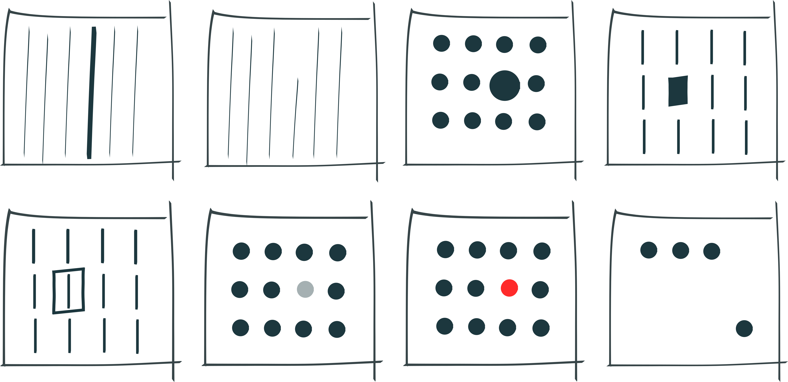

```{r setup, include=FALSE}
#set up
knitr::opts_chunk$set(echo = FALSE, message = FALSE, echo = FALSE, warning = FALSE, fig.height=10, fig.width=19, out.width = "80%")
knitr::read_chunk("scripts/Nightingale.R")

# libraries
library(ggplot2) # graphs
library(patchwork) # tiling of graph outputs
library(RColorBrewer) # colour palettes
library(tibble) # for tibble compatability
library(DT)

# colours
palette.1 <- "#1f78b4"
palette.2 <- c("#1f78b4", "#b2df8a")
```

##

```{r, nightingale-polar-plot}
```

##
```{r, nightingale-side-by-side-plot}
```

## Overview

* Acquisition, Reliability and Trust
* Organization and Data Set Structure
* Data Types
* Data Processing or Interpretation
* Visual Layering of Content
* Visualizing Raw vs Statistical Computations of Data

## What is Data Visualization?

## What is Data Visualization?{.center}

[Data visualization turns data into visual information. We could turn data into auditory or tactile information as well.]{.lgp}

## What is Data Visualization?{.center}

[Data visualization turns data into visual information. We could turn data into auditory or tactile information as well.]{.grey .lgp}

[This involves abstraction as shapes, colours etc are used represent the data.]{.lgp}

## What is Data Visualization?{.center}

[Data visualization turns data into visual information. We could turn data into auditory or tactile information as well.]{.grey .lgp}

[This involves abstraction as shapes, colours etc are used represent the data.]{.grey .lgp}

[Visual and data literacies are needed to interpret both the data and the abstraction.]{.lgp}

## Why Do We Visualize Data?

## A Definition

> Data visualization is the graphical display of abstract information for two purposes: sense-making (also called data analysis) and communication.

<span class = "citation">Stephen Few. [Data Visualization for Human Perception](https://www.interaction-design.org/literature/book/the-encyclopedia-of-human-computer-interaction-2nd-ed).</span>

## Attributes & Perception

> Even though an object as a whole might take some conscious effort to identify, the basic visual attributes that combine to make up that object are perceived without any conscious effort.

<span class = "citation">Stephen Few (2004). [Tapping the Power of Visual Perception](http://www.perceptualedge.com/articles/ie/visual_perception.pdf).</span>

## An Example


## An Example


## Preattentive Attributes

-   Form
-   Colour
-   Position

## Form

::: image

:::

## Colour

::: image

:::

## Position

::: image

:::

## Preattentive Attributes

::: image

:::

# Types of Visualisations

## 

::: image

:::

## 

::: image

:::

## Categorical Data {.center}

**Nominal data**

[**No order**]{style="color:#00aad4ff;"}

::: medium

:::

**Ordinal data**

[**Intrinsic order**]{style="color:#aad400ff;"}

::: medium

:::

## Categorical Data {.center}

**Nominal data**

[**No order**]{style="color:#00aad4ff;"}

::: medium

:::

**Ordinal data**

[**Intrinsic order**]{style="color:#aad400ff;"}

::: medium

:::

## Bar Plots {.center}

**Visualization tool**

[**Frequency plots with bar charts**]{style="color:#ff2a2aff;"}

::: small

:::

## {.col2}

```{r load-lfs}
## load LFS data
lfs <- read.csv("data/LFS_2020_recoded_subset.csv",
                header = TRUE,
                na.strings = c("", " ", "NULL"))

lfs.df <- data.frame(
  variable = names(lfs),
  class = sapply(lfs, typeof),
  first_6_values = sapply(lfs, function(x) paste(head(x), collapse = ", ")),
  row.names = NULL
)

colnames(lfs.df) <- c("Variable", "Data type", "First 6 values")

lfs.df
```

## {.tr4 .col2}

```{r lfs-workforce-highlight}
lfs.df
```

##

```{r lfs-workforce-summary-table}
status.df <- data.frame(table(lfs$Labour.force.status))

colnames(status.df) <- c("Employment Status", "Count")

status.df
```

## {.graph .center}

```{r lfs-workforce-alpha}
status.theme <- theme_minimal() +
  theme(panel.grid.major.x=element_blank(),
        panel.grid.minor.x=element_blank(),
        text = element_text(size = 25)
        )

status.plot <- ggplot(lfs, aes(x = Labour.force.status)) +
  geom_bar(fill = palette.1) +
  labs(x = "Employment Status", y = "Count") +
  status.theme

status.plot
```

## {.graph .center}

```{r lfs-workforce-count}
lfs$labour.force.status.ordered <- factor(lfs$Labour.force.status, levels = c("Unemployed", "Employed, absent from work", "Not in labour force", "Employed, at work"))

status.plot.ord <- ggplot(lfs, aes(x = labour.force.status.ordered)) +
  geom_bar(fill = palette.1) +
  labs(x = "Status", y = "Count") +
  status.theme

status.plot.ord
```

## {.tr9 .col2}

```{r lfs-edu-highlight}
lfs.df
```

## 

```{r lfs-edu-summary-table}
edu.df <- data.frame(table(lfs$Highest.educational.attainment))

colnames(edu.df) <- c("Education", "Count")

edu.df
```

## {.graph .center}

```{r lfs-edu-count}
## factor education
lfs$Highest.educational.attainment <- factor(lfs$Highest.educational.attainment,
                                             levels = c("0 to 8 years",
                                                        "Some high school",
                                                        "High school graduate",
                                                        "Some postsecondary",
                                                        "Postsecondary certificate or diploma",
                                                        "Bachelor's degree",
                                                        "Above bachelor's degree"))

# base theme
edu.theme <- theme_minimal() +
  theme(panel.grid.minor.x=element_blank(),
        panel.grid.major.x=element_blank(),
        text = element_text(size = 25)
        )

# education by count
education.count <- ggplot(lfs, aes(x = reorder(Highest.educational.attainment,
                          table(Highest.educational.attainment)[Highest.educational.attainment]))) +
  geom_bar(fill = palette.1) +
  labs(x = "", y = "") +
  edu.theme +
  theme(
    axis.text.x = element_text(angle = 45, hjust = 1)
  )

education.count
```

## {.graph .center}

```{r, lfs-edu-factor}
# education properly factored
education.factor <- ggplot(lfs, aes(x = Highest.educational.attainment)) +
  geom_bar(fill = palette.1) +
  labs(x = "", y = "") +
  edu.theme +
  theme(
    axis.text.x = element_text(angle = 45, hjust = 1)
  )

education.factor
```

## {.graph .center}

```{r lfs-edu-vertical-vs-horizontal}
education.angledText <- education.factor +
  coord_flip() +
  theme(axis.text.x = element_text(angle = 0, hjust = 0))

education.factor + education.angledText + labs(caption = "n = 360554") +
  theme(plot.caption = element_text(size = 25, hjust = 0.5),
        plot.margin = margin(2, 4, 2, 2, "cm"),
        panel.grid.major.x = element_line(),
        panel.grid.major.y = element_blank()
        )
```

## {.graph .center}

```{r stack-vs-side-by-side}
lfs$Survey.month <- factor(lfs$Survey.month, levels = c("January", "April", "July", "October"))

base <- ggplot(data = lfs, aes(x = Survey.month, fill = Labour.force.status)) +
  scale_fill_brewer(palette = "Set2") +
  edu.theme +
  labs(
    fill = "Labour Force Status",
    x = "Month",
    y = "Count")

side_by_side <- base +
  geom_bar(position = "dodge") +
  theme(
    legend.position = "none"
  )

stacked <- base +
  geom_bar() +
  ylab("")
  

comb <- side_by_side + stacked & theme(
  legend.position = "bottom",
  legend.direction = "vertical"
  ) 

comb + plot_layout(guides = "collect")
```

## Numeric Data {.center}

**Discrete** = [**Counted**]{style="color:#aad400ff;"}

**Continuous** = [**Measured**]{style="color:#00aad4ff;"}

::: smallmedium

:::

## Numeric Data {.center}

**Interval** = [**Greater or less than**]{style="color:#ff2a2aff;"}

**Ratio** = [**Percentage more or less**]{style="color:#d42affff;"}

::: smallmedium

:::

## Counts of Numeric Data {.center}

**Visualization tool**

[**Frequency plots with histograms**]{style="color:#aad400ff;"}

::: small

:::

## {.tr19 .col2}

```{r lfs-wage-highlight}
lfs.df
```

------------------------------------------------------------------------

```{r, wages-as-line, results='asis'}
wages <- subset(lfs$Usual.hourly.wages..employees.only., lfs$Usual.hourly.wages..employees.only. != "NA")
cat(head(round(wages), n = 120))
```

------------------------------------------------------------------------

```{r, wages-as-data-table, results='asis'}
wages_int <- as.integer(wages)
wages_df <- as.data.frame(table(wages_int))
wages_df$wages_int <- as.integer(as.character(wages_df$wages_int))
colnames(wages_df) <- c("Hourly Wage", "Count")
cat(head(round(wages), n = 120))
datatable(wages_df, rownames = FALSE)
```

------------------------------------------------------------------------

```{r wages-as-point-1, results='asis'}
cat(head(round(wages), n = 120))
datatable(wages_df, rownames = FALSE)
```

```{r wages-as-point-2, dpi = 72, out.width = "40%", fig.asp = .8}
wages_point <- ggplot(wages_df, aes(x = `Hourly Wage`, y = Count)) +
  geom_point(colour = palette.1, size = 5) +
  edu.theme +
  theme(
    axis.title = element_text(size = 35),
    plot.margin = margin(2, 4, 2, 2, "cm")
  )

wages_point
```

## {.graph .center}

```{r wages-points-histo-side-be-side}
wages_hist_df <- as.data.frame(wages)
colnames(wages_hist_df) <- "Hourly Wage"
wages_hist_base <- ggplot(wages_hist_df, aes(`Hourly Wage`)) +
  edu.theme +
  theme(
    axis.text.y = element_blank()
  )

wages_hist_plot <- wages_hist_base +
  geom_histogram(fill = palette.1) +
  labs(y = "") +
  theme(
    axis.title = element_text(size = 35)
  )

wages_point + wages_hist_plot
```

## {.graph .center}

```{r wages-histo}
# subset for wages
lfs.wages <- subset(lfs, lfs$Usual.hourly.wages..employees.only. != "NA")

# rename columns
names(lfs.wages)[names(lfs.wages) == "Usual.hourly.wages..employees.only."] <- "HourlyWages"

# basic plot
wages.binned <- ggplot(lfs.wages, aes(HourlyWages)) +
  scale_x_continuous(breaks = c(0, 30, 60, 90, 120)) +
  theme_minimal() +
  theme(panel.grid.minor.x=element_blank(),
        panel.grid.major.x=element_blank(),
        text = element_text(size = 25))

wages.binned.30 <- wages.binned +
  geom_histogram(bins = 30, fill = palette.1) +
  labs(x = "Hourly Wages", y = "Frequency")

wages.binned.30 +
  theme(
  plot.caption = element_text(size = 25, hjust = 0.5),
  axis.title.y = element_text(vjust = 2)
  )
```

##

```{r wages-histo-multi-bin}
wages.binned.100 <- wages.binned +
  geom_histogram(bins = 100, fill = palette.1) +
  labs(x = "", y = "")

wages.binned.20 <- wages.binned +
  geom_histogram(bins = 60, fill = palette.1) +
  labs(x = "", y = "Frequency")

wages.binned.5 <- wages.binned +
  geom_histogram(bins = 5, fill = palette.1) +
  labs(x = "Hourly Wages", y = "")

(wages.binned.20 + wages.binned.100) / (wages.binned.30 + wages.binned.5) + labs(caption = "n = 168389") +
  theme(
    plot.caption = element_text(size = 25, hjust = 0.5),
    axis.title.y = element_text(vjust = 2),
    axis.title.x = element_text(vjust = -1)
    )
```

## {.graph .center}

```{r provincial-unemployment}
lfs_unemp <- subset(lfs, lfs$Labour.force.status == "Unemployed" & lfs$Survey.month == "January", select = c(Province, Labour.force.status))

lfs_unemp_dt <- as.data.frame(table(lfs_unemp))

levels(lfs_unemp_dt$Province) <- c("British Columbia",
                                   "Alberta",
                                   "Saskatchewan",
                                   "Manitoba",
                                   "Ontario",
                                   "Quebec",
                                   "New Brunswick",
                                   "Prince Edward Island",
                                   "Nova Scotia",
                                   "Newfoundland and Labrador")

prov_unemp <- ggplot(lfs_unemp_dt, aes(x = Province, y = Freq)) +
  geom_col(fill = palette.1) +
  status.theme +
  theme(
    axis.text.x = element_text(angle = 45, hjust = 1)
  ) +
  labs(x = "Province",
       y = "Unemployed (January 2020)")

prov_unemp
```

## {.graph .center}

```{r provincial-unemployment-colour}
prov_unemp_col <- ggplot(lfs_unemp_dt, aes(x = Province, y = Freq, fill = Province)) +
  geom_col() +
  status.theme +
  theme(
    axis.text.x = element_text(angle = 45, hjust = 1)
  ) +
  labs(x = "Province",
       y = "Unemployed (January 2020)") +
  scale_fill_brewer(palette = "Set2")

prov_unemp_col
```

## {.graph .center}

```{r provincial-unemployment-no-maritime}
prov_unemp_sub <- ggplot(lfs_unemp_dt[1:6,], aes(x = Province, y = Freq)) +
  geom_col(fill = palette.1) +
  status.theme +
  theme(
    axis.text.x = element_text(angle = 45, hjust = 1)
  ) +
  labs(x = "Province",
       y = "Unemployed (January 2020)") 

prov_unemp_sub
```

## {.graph .center}

```{r provincial-unemployment-no-maritime-skewed}
prov_unemp_skew <- prov_unemp_sub +
  coord_cartesian(ylim = c(230, 500)) +
  theme(
    axis.title.y = element_blank()
  )

prov_unemp_sub + prov_unemp_skew
```

# Dot Plots & Line Graphs

##

```{r life-expectancy-data-view}
# read in the data
lifeExp.data <- read.csv("data/LifeExpectency.csv", header = TRUE)

# susbet 2016
lifeExp.2016 <- subset(lifeExp.data, lifeExp.data$Year == 2016)

# take a sample
set.seed(80)
lifeExp.sample <- lifeExp.2016[sample(nrow(lifeExp.2016), 20, replace = FALSE), ]

lifeExp.sample
```

## {.graph .center}

```{r life-expectancy-dot-vs-bar}
# base theme

lifeExp.theme <-   theme_minimal() +
  theme(panel.grid.minor=element_blank(),
        panel.grid.major=element_blank(),
        text = element_text(size = 20))

lifeExp.bar <- ggplot(lifeExp.sample, aes(Life.expectency, reorder(Country, Life.expectency))) +
  geom_col(fill = palette.1) +
  xlab("Years") +
  ylab("Country") +
  lifeExp.theme

LifeExp.dot <- ggplot(lifeExp.sample, aes(Life.expectency, reorder(Country, Life.expectency))) +
  geom_point(colour = palette.1, size = 3) +
  xlab("Years") +
  ylab("") +
  lifeExp.theme

lifeExp.bar + LifeExp.dot
```

## {.graph .center}

```{r life-expectancy-dot-plot-options}
lifeExp.dot.alpha <- ggplot(lifeExp.sample, aes(Life.expectency, factor(Country, levels = rev(levels(factor(Country)))))) +
  geom_point(colour = palette.1, size = 3) +
  xlab("Years") +
  ylab("Country") +
  lifeExp.theme

lifeExp.dot.reverse <- ggplot(lifeExp.sample, aes(Life.expectency, reorder(Country, -Life.expectency))) +
  geom_point(colour = palette.1, size = 3) +
  xlab("Years") +
  ylab("") +
  lifeExp.theme

lifeExp.dot.alpha + LifeExp.dot + lifeExp.dot.reverse
```

## {.graph .center}

```{r, life-expectancy-canada}
# subset the data
LifeExp.Canada <- subset(lifeExp.data, lifeExp.data$Country == "Canada")

lifeExp.Canada.dot <- ggplot(LifeExp.Canada, aes(Year, Life.expectency)) +
  geom_point(colour = palette.1, size = 2) +
  ylab("") +
  xlab("") +
  theme_minimal() +
  theme (
    text = element_text(size = 20)
  )

LifeExp.Canada.line <- ggplot(LifeExp.Canada, aes(Year, Life.expectency)) +
  geom_line(colour = palette.1, size = 1.25) +
  ylab("") +
  xlab("Year") +
  theme_minimal() +
  theme (
    text = element_text(size = 20)
  )

(lifeExp.Canada.dot / LifeExp.Canada.line) +
  labs(y = "Life Expectency in Years (Canada)") +
  theme(
    axis.title.y = element_text(hjust = 3, vjust = 3)
    )
```

## {.graph .center}

```{r, life-expectancy-canada-three-options}
lifeExp.Canada.dotLine <- ggplot(LifeExp.Canada, aes(Year, Life.expectency)) +
  geom_line(colour = palette.2[2], size = 1.25) +
  geom_point(colour = palette.1, alpha = 0.5, size = 3) +
  ylab("") +
  theme_minimal() +
  theme (
    text = element_text(size = 20)
  )

(lifeExp.Canada.dot / LifeExp.Canada.line / lifeExp.Canada.dotLine) +
  labs(y = "Life Expectency in Years (Canada)") +
  theme(
    axis.title.y = element_text(hjust = -9, vjust = 3)
  )
```

##

```{r weather-data}
# load the data
weather.data <- read.csv("data/weather.csv", header = TRUE, na.strings = c("", " ", "NULL"))

# subset the data
weather.temp <- subset(weather.data, select = c(Date.Time, Month, Mean.Temp..C.))

weather.data[1:12, 1:10]
```

## {.graph .center}

```{r weather-aspect-ratio-3-options}
# rename and udpate class
colnames(weather.temp) <- c("Date", "Month", "MeanTemp")
weather.temp$Date <- as.Date(weather.temp$Date)

# base plot
weather.plot <- ggplot(weather.temp, aes(Date, MeanTemp, colour = MeanTemp)) +
  geom_line(size = 1.25) +
  labs(x = "", y = "") +
  scale_x_date(date_labels = "%b") +
  theme_minimal() +
  theme(legend.position = "none",
        text = element_text(size = 20))

# define the layout for scaling
layout <- "
111
22#
3##
"

weather.plot + weather.plot + weather.plot +
  plot_layout(design = layout) +
  plot_annotation(title = "Daily Average Temperature C
                  \nKelowna 2000",
                  theme = theme(
                    plot.title = element_text(hjust = 0.5, size = 20)))
```

## {.graph .center}

```{r weather-aspect-ratio-2-options}
layout2 <- "
111
2##
"

weather.plot + weather.plot +
  plot_layout(design = layout2) +
  plot_annotation(title = "Daily Average Temperature C
                  \nKelowna 2020",
                  theme = theme(plot.title = element_text(hjust = 0.5, size = 20)))
```

## {.graph .center}

```{r, weather-colour}
weather.plot.magma <- weather.plot +
  scale_colour_viridis_c(option = "magma")

weather.plot + weather.plot.magma +
  plot_layout(design = layout2) +
  plot_annotation(title = "Daily Average Temperature C
                  \nKelowna 2020",
                  theme = theme(plot.title = element_text(hjust = 0.5, size = 20)))
```

## Layering Data and Statistics

##  {.noheader .graph}

```{r}
data <- read.csv("data/lifeExpectencyVSgpd.csv", header = TRUE, na.strings = c("", " ", "NULL"))

colnames(data) <- c("Country", "Code", "Year", "Population", "Continent", "Life.Expectency", "GDP")

data2015 <- subset(data, Year == 2015 & GDP != "NA" & Life.Expectency != "NA" & Code != "NA" & Continent != "NA")

set.seed(2)

data.gpd <- as_tibble(data2015)

head(data.gpd[sample(nrow(data.gpd), 20), ], 20)
```

##  {.noheader .graph .td6 .td7}

```{r}
set.seed(2)

head(data.gpd[sample(nrow(data.gpd), 20), ], 20)
```

##  {.noheader .center .graph}

```{r, dpi = 72}
library(scales)
data <- read.csv("data/lifeExpectencyVSgpd.csv", header = TRUE, na.strings = c("", " ", "NULL"))
colnames(data) <- c("Country", "Code", "Year", "Population", "Continent", "Life.Expectency", "GDP")
data2015 <- subset(data, Year == 2015 & GDP != "NA" & Life.Expectency != "NA" & Code != "NA" & Continent != "NA")

gdp.le.base <- ggplot (data2015) +
  labs(x = "GDP", y = "Life Expectency", colour = "Continent") +
  theme_minimal() +
  theme(
    text = element_text(size = 40)
  ) +
  scale_color_brewer(palette = "Dark2")

no.colour <- gdp.le.base +
  geom_point(aes(GDP, Life.Expectency), size = 5) +
  xlim(0, 150000) +
  scale_x_continuous(labels = dollar_format(prefix = "$"))

no.colour
```

##  {.noheader .graph .td6 .td7}

```{r}
set.seed(2)

head(data.gpd[sample(nrow(data.gpd), 20), ], 20)
```

##  {.noheader .graph .td6 .td7 .td4G .td5G}

```{r}
set.seed(2)

head(data.gpd[sample(nrow(data.gpd), 20), ], 20)
```

##  {.noheader .center .graph}

```{r, dpi = 72}
with.colour <- gdp.le.base +
  geom_point(aes(GDP, Life.Expectency, colour = factor(Continent)), size = 5) +
  xlim(0, 150000) +
  scale_x_continuous(labels = dollar_format(prefix = "$")) +
  guides(colour = guide_legend(override.aes = list(size=10)))

with.colour
```

##  {.noheader .center .graph}

```{r, dpi = 72}
colour.size <- gdp.le.base +
  geom_point(aes(GDP, Life.Expectency, colour = factor(Continent), size = Population)) +
  xlim(0, 150000) +
  scale_x_continuous(labels = dollar_format(prefix = "$")) +
  scale_size(range = c(2,15), guide = "none") +
  guides(colour = guide_legend(override.aes = list(size=10)))

colour.size
```

##  {.noheader .center .graph}

```{r, dpi = 72}
colour.size <- gdp.le.base +
  geom_point(aes(GDP, Life.Expectency, colour = factor(Continent), size = Population), alpha = 0.7) +
  xlim(0, 150000) +
  scale_x_continuous(labels = dollar_format(prefix = "$")) +
  scale_size(range = c(2,15), guide = "none") +
  guides(colour = guide_legend(override.aes = list(size=10)))

colour.size
```

##  {.noheader .center .smgraph}

```{r, dpi = 72}
colour.size.log <- gdp.le.base +
  geom_point(aes(GDP, Life.Expectency, colour = factor(Continent), size = Population), alpha = 0.7) +
  scale_x_log10(labels = dollar_format(prefix = "$")) +
  scale_size(range = c(2,15), guide = "none") +
  guides(colour = guide_legend(override.aes = list(size=10)))

colour.size +
  theme(
    legend.position = "none"
  )
colour.size.log +
  labs(y = "")
```

##  {.noheader .center .graph}

```{r}
colour.size.log
```

##  {.noheader .center .graph}

```{r, dpi = 72}
gdp.le.lm <- ggplot (data2015, aes(GDP, Life.Expectency)) +
  geom_point(aes(colour = factor(Continent), size = Population), alpha = 0.7) +
  scale_x_log10(labels = dollar_format(prefix = "$")) +
  scale_size(range = c(2,15), guide = "none") +
  guides(colour = guide_legend(override.aes = list(size=10))) +
  geom_smooth(method = "lm", se = F) +
  labs(x = "GDP", y = "Life Expectency", colour = "Continent") +
  theme_minimal() +
  theme(
    text = element_text(size = 40)
  ) +
  scale_color_brewer(palette = "Dark2")


gdp.le.lm
```

##  {.noheader .center .graph}

```{r, dpi = 72}
gdp.le.lm +
  facet_wrap( ~ Continent) +
  theme(
    axis.text.x = element_text(size = 20, angle = 45),
    axis.ticks.x = element_line(colour = "red", size = 2)
  )
```

# Pie Charts

## {.graph .center}

```{r piechart}
piechart <- subset(lfs, select = Highest.educational.attainment)
piechart$Highest.educational.attainment <- factor(lfs$Highest.educational.attainment,
                                             levels = c("0 to 8 years",
                                                        "Some high school",
                                                        "High school graduate",
                                                        "Some postsecondary",
                                                        "Postsecondary certificate or diploma",
                                                        "Bachelor's degree",
                                                        "Above bachelor's degree"))
piechart <- data.frame(table(piechart))
colnames(piechart) <- c("Education", "Count")
total <- sum(piechart$Count)
Percent <- round(piechart$Count/total, 2) * 100
piechart <- cbind(piechart, Percent)
piechart <- piechart[order(piechart$Education, decreasing=TRUE), ]

ypos <- cumsum(piechart$Percent) - 0.5*piechart$Percent

piechart <- cbind(piechart, ypos)

pc <- ggplot(piechart, aes(x = "", y = Percent, fill = Education)) +
  geom_bar(width = 1, stat = "identity", colour = "black") +
  coord_polar("y", start=0) +
  theme_void() +
  theme(
    text = element_text(size = 25),
    legend.spacing = unit(3, "cm"),
    legend.key.size = unit(1, "cm")
  ) +
  scale_fill_brewer(palette = "Dark2")

pc +
  geom_text(aes(y = ypos, label = paste0(Percent,"%")), color = "white", size=8)
```

## {.noheader .center .graph   }

```{r piechart-barchart}
bar <- ggplot(piechart, aes(x = Education, y = Count, fill = Education)) +
  geom_col() +
  geom_text(aes(label = paste0(Percent," %")), vjust = 2.5, colour = "#ffffff", size = 5, fontface = "bold") +
  theme_minimal() +
  theme(panel.grid.major=element_blank(),
        panel.grid.minor=element_blank(),
        text = element_text(size = 25),
        axis.title = element_blank(),
        axis.text.x = element_blank()
        ) +
  scale_fill_brewer(palette = "Dark2")

pc_nolegend <- pc +
  geom_text(aes(y = ypos, label = paste0(Percent,"%")), color = "white", size=6) +
  theme(
    legend.position = "none"
  )

pc_nolegend + bar
```

##  {.center .nopadding}

Colour should be meaningful and take into account the nature of the data being graphed. It should also be attune to colour blindness.

Sequential


Diverging


Qualitative


ColorBrewer <https://colorbrewer2.org/>

# Finding Data

## CBC Fatal Police Encounters

::: image

:::

## Guiding Questions

::: ppushed
Who would be responsible for

* Generating or producing the data
* Keeping a record of the data
* Reporting out on the data

Who would have an interest in keeping a record of the data
:::

## Data Aggregators

::: ppushed
* Governments
  * Municipal, Provincial/Sate, Federal/National
  * [City of Kelowna open data portal](https://opendata.kelowna.ca/)
* UN Agencies
  * World Health Organization (WHO) [Data](https://www.who.int/data/collections)
* Intergovernmental Organizations
  * Organization for Economic Co-Operation and Development (OECD) [Data](https://stats.oecd.org/)
* International Bodies
  * World Bank [Data](https://datacatalog.worldbank.org/)
:::

## UBC Data Guide

* Need more? A list of public access data sources on a range of topics
  * https://guides.library.ubc.ca/c.php?g=712037&p=5075056 

## UBC Purchased Data Sets

Purchased and leased data sets are available in a couple of ways:

* [Abacus](https://resources.library.ubc.ca/page.php?details=abacus-data-repository&id=1114), where we host data sets
* [On our databases page](https://resources.library.ubc.ca/?searchtype=keywords&search=data), where we link to data we don\'t host.
  
## Statistics Canada

* Table data
  * aggregated
  * free
* Public Use Microdata Files
  * non aggregated, anonymized
  * fee based, but increasingly less so
  * [available through UBC free of charge](https://resources.library.ubc.ca/page.php?details=abacus-data-repository&id=1114)
* Raw survey data
  * highly restricted
